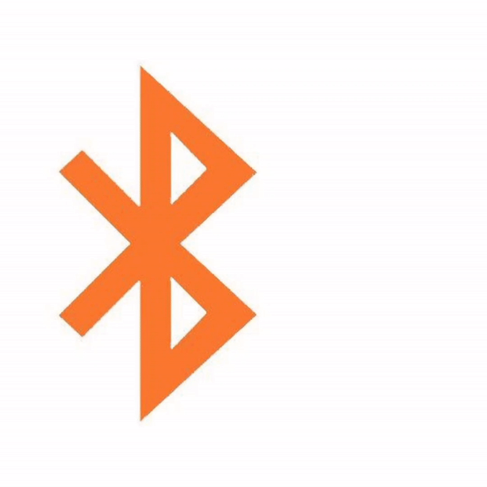

# BLE SPAM 📡 — Next-Gen Spoofing Toolkit

[**English**](../README.md)

[](https://developer.android.com)
[](LICENSE)
[](https://t.me/blespam)

<p align="center">
  
</p>

---

## 🚀 Overview
**BLE SPAM** — это продвинутый инструмент для тестирования Bluetooth Low Energy (BLE) протоколов и симуляции рекламных пакетов (advertising packets). Проект базируется на исследованиях ведущих специалистов в области мобильной безопасности и адаптирован для работы на современных Android-устройствах.

Основано на работах:
- [Willy-JL](https://github.com/Willy-JL)
- [Spooks4576](https://github.com/Spooks4576) 
- [ECTO-1A](https://github.com/ECTO-1A)

### Поддерживаемые платформы (Target):
  

---

## 🔥 Core Features

### Protocol Matrix
| Protocol                | Target OS          | Impact Level        |
|-------------------------|--------------------|--------------------|
| 🍏 **Apple Continuity** | iOS/iPadOS 17+     | System Reboot 💥    |
| 🤖 **Google Fast Pair** | Android 8.0+        | Persistent Spam 📈 |
| 📲 **Samsung EasySetup**| Android 10+        | UI Freeze 🛑        |
| 💻 **Microsoft Swift** | Windows 10/11      | Custom Pairing ✨    |

### Key Capabilities
* **195+ Пресетов:** Готовые профили популярных устройств (AirPods, Pixel Buds, Watch и др.).
* **Тайминги:** Точная настройка интервалов рекламы (от 20мс до 2000мс).
* **Multi-Chaining:** Возможность запуска нескольких протоколов одновременно.
* **Native Security:** Ядро защиты и сетевые эндпоинты вынесены в C++ (JNI) для затруднения анализа.
* **Crash Analytics:** Модуль отслеживания эффективности атак.

---

## ⚙️ System Requirements
```yaml
min_android: 8.0 (API 26)
recommended_ram: 2GB+
bluetooth: LE 4.2+ (поддержка Extended Advertising приветствуется)
storage: 15MB free

```

---

## 🛠 Сборка и Настройка (Self-Hosting)

Для обеспечения безопасности проекта, все API-ключи и эндпоинты удалены из публичного кода. Чтобы собрать рабочее приложение, выполните следующие шаги:

### 1. Конфигурация Firebase

Поместите ваш `google-services.json` в папку `app/`. Шаблон файла:

```json
{
  "project_info": { "project_id": "your-id" },
  "client": [ { "api_key": [ { "current_key": "YOUR_KEY" } ] } ]
}

```

### 2. Настройка Native Layer (C++)

Отредактируйте файл `app/src/main/cpp/native-lib.cpp`:

1. Вставьте свой XOR-ключ в переменные `K1-K6`.
2. Добавьте зашифрованные HEX-байты ваших API-адресов в массивы `D1-D7`.
3. Обновите пути JNI функций в соответствии с вашим `package_name`.

### 3. Компиляция

```bash
./gradlew assembleRelease

```

---

## ⚠️ Disclaimer

Данный инструмент предназначен исключительно для **образовательных целей** и тестирования на проникновение в рамках санкционированного аудита безопасности. Автор не несет ответственности за любой ущерб, причиненный использованием данного ПО.

**Используйте ответственно!**

---

## 🤝 Contribution

Если у вас есть новые BLE-дампы или идеи по улучшению протоколов:

1. Fork проекта.
2. Создайте ветку `feature/new-protocol`.
3. Сделайте Pull Request.

---

<p align="center">
Разработано с ❤️ для комьюнити BLE-исследователей.
</p>
